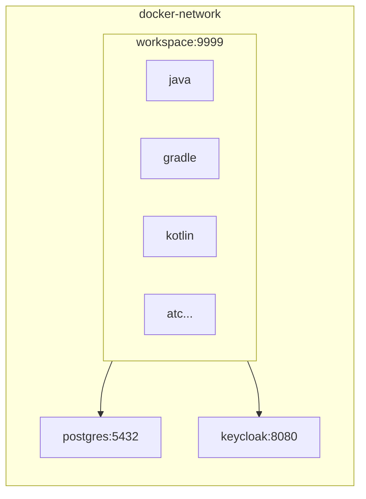

# devcontainer

## workspace
- package
    - vim
    - curl
    - unzip
    - zip
    - tzdata
    - git
    - atc..
- sdkman
    - java
    - gradle
    - maven
    - kotlin
- nvm
- z

## postgres

## nginx

## keycloak

## docker compose diagram
