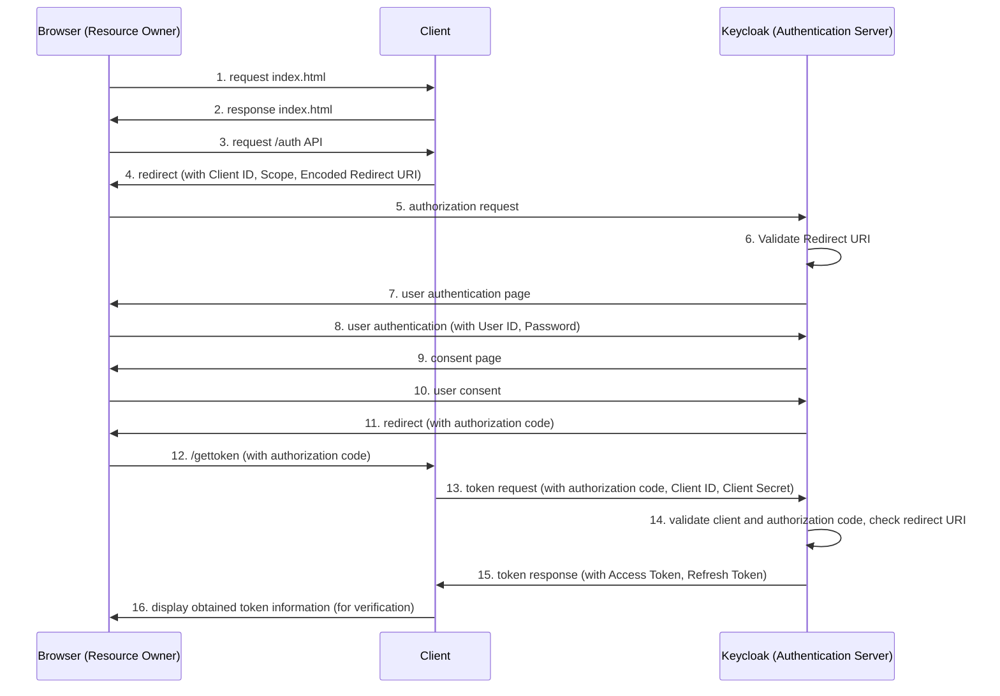

## Token Introspection Flow



## Endpoint

### POST `/auth` 

#### Description:
Sends an [authorization request](https://www.keycloak.org/docs/22.0.1/securing_apps/#authorization-endpoint) and redirects the user to the authorization server.

#### Request Query Parameters

| Name  | Type   | Nullable | Description                        |
|-------|--------|----------|------------------------------------|
| scope | string | true     | The scope of the access request.   |

#### Redirect Parameters (302 Found) `/realms/{realm-name}/protocol/openid-connect/auth`

| Name         | Type   | Nullable | Value                          | Description                                  |
|--------------|--------|----------|--------------------------------|----------------------------------------------|
| client_id    | string | false    | [specified by client]           | The client ID issued to the client.          |
| redirect_uri | string | false    | [specified by endpoint]/gettoken        | The URI to which the response will be sent.  |
| response_type| string | false    | code                           | The type of response expected.               |
| scope        | string | true     | [specified by client]          | The scope of the access request.             |

### GET `/gettoken` 

#### Request Query Parameters

| Name              | Type   | Nullable | Description                                                  |
|-------------------|--------|----------|--------------------------------------------------------------|
| code              | string | false    | The authorization code received from the authorization server. |
| state             | string | true     | A random string to maintain state between the request and callback. |
| error             | string | true     | Error code returned by the authorization server if authorization fails. |
| error_description | string | true     | Error description returned by the authorization server if authorization fails. |


#### Responses Parameters

###### Success (200)

| Name               | Type    | Nullable | Description                                                |
|--------------------|---------|----------|------------------------------------------------------------|
| access_token       | string  | false    | The access token issued by the authorization server.        |
| expires_in         | integer | false    | The lifetime in seconds of the access token.                |
| refresh_expires_in | integer | false    | The lifetime in seconds of the refresh token.               |
| refresh_token      | string  | false    | The refresh token which can be used to obtain new access tokens. |
| id_token           | string  | false    | The ID token issued by the authorization server.            |
| token_type         | string  | false    | The type of token issued as described in RFC 6749.         |
| not_before_policy  | integer | false    | The value of the not-before policy for the token.           |
| session_state      | string  | false    | The session state associated with the token.                |
| scope              | string  | false    | The scope of the access token as described in RFC 6749.     |

Example:
```json
{
  "access_token": "string",
  "expires_in": 3600,
  "refresh_expires_in": 7200,
  "refresh_token": "string",
  "id_token": "string",
  "token_type": "Bearer",
  "not_before_policy": 0,
  "session_state": "string",
  "scope": "openid email profile"
}
