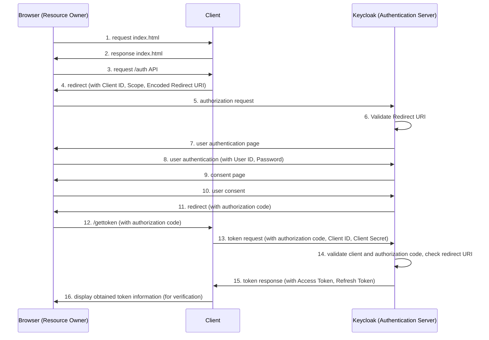

# Token Introspection Flow

```mermaid
sequenceDiagram
    participant Browser as Browser (Resource Owner)
    participant Client as Client
    participant Keycloak as Keycloak (Authentication Server)

    Browser->>Client: 1. request index.html
    Client->>Browser: 2. response index.html
    Browser->>Client: 3. request /auth API 
    Client->>Browser: 4. redirect (with Client ID, Scope, Encoded Redirect URI)
    Browser->>Keycloak: 5. authorization request
    Keycloak->>Keycloak: 6. Validate Redirect URI
    Keycloak->>Browser: 7. user authentication page
    Browser->>Keycloak: 8. user authentication (with User ID, Password)
    Keycloak->>Browser: 9. consent page
    Browser->>Keycloak: 10. user consent
    Keycloak->>Browser: 11. redirect (with authorization code)
    Browser->>Client: 12. /gettoken (with authorization code)
    Client->>Keycloak: 13. token request (with authorization code, Client ID, Client Secret)
    Keycloak->>Keycloak: 14. validate client and authorization code, check redirect URI
    Keycloak->>Client: 15. token response (with Access Token, Refresh Token)
    Client->>Browser: 16. display obtained token information (for verification)
```